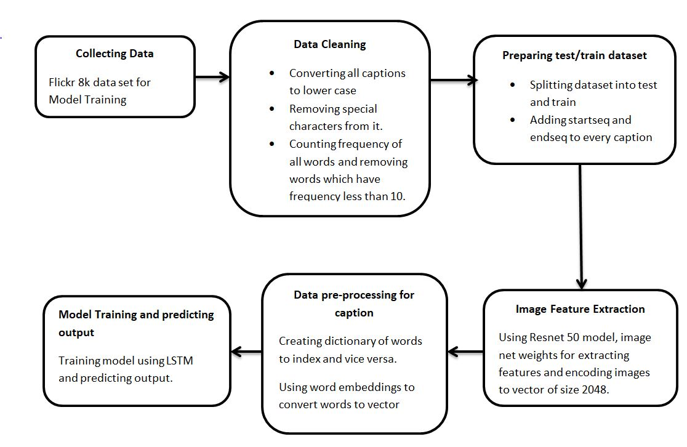

# Image Captioning
## Description
This application will generate caption for the image uploaded using a LSTM based deep learning model.
The web application was developed using flask framework and deployed using heroku and the link for the application is https://image-caption-flask.herokuapp.com/

## How to use the application
<ul>
<li>The user has to upload image which can be  in any format by clicking on choose file button.</li>
<li>Then press the submit button</li>
<li>After which the deep learning model at the backend will generate caption for the image uploaded.</li>
</ul>

## Methodology
<ul>
<li>The dataset used for training the model is https://www.kaggle.com/adityajn105/flickr8k.</li>
<li>Used a 50-layer deep learning model, RESNET-50, to extract features from the image</li>
<li>Used Word embeddings to convert words to vectors</li>
<li>Language Modeling: used Recurrent Neural Network and LSTM to generate caption.</li>
</ul>

### Flowchart of Methodology

## I/O screenshots
### Input

### Output

### Input

### Output

## Authors
Ayush Goel

## License
[MIT](https://choosealicense.com/licenses/mit/)
